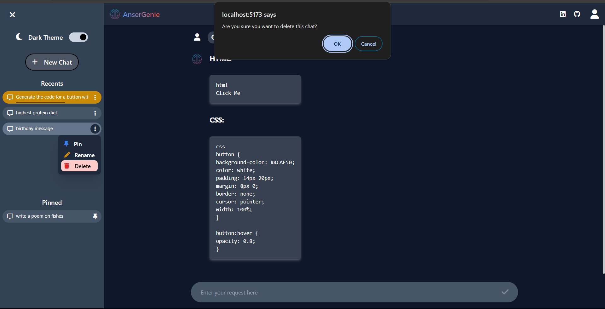
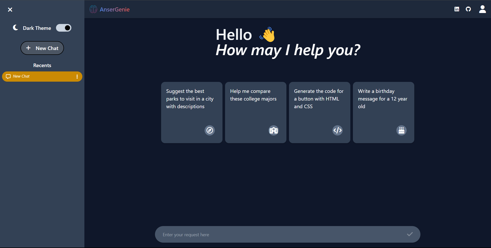
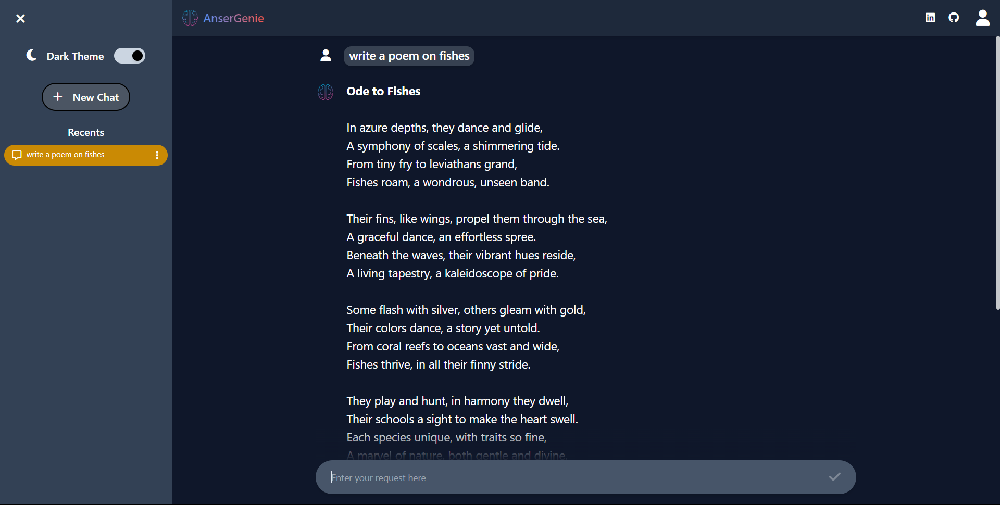
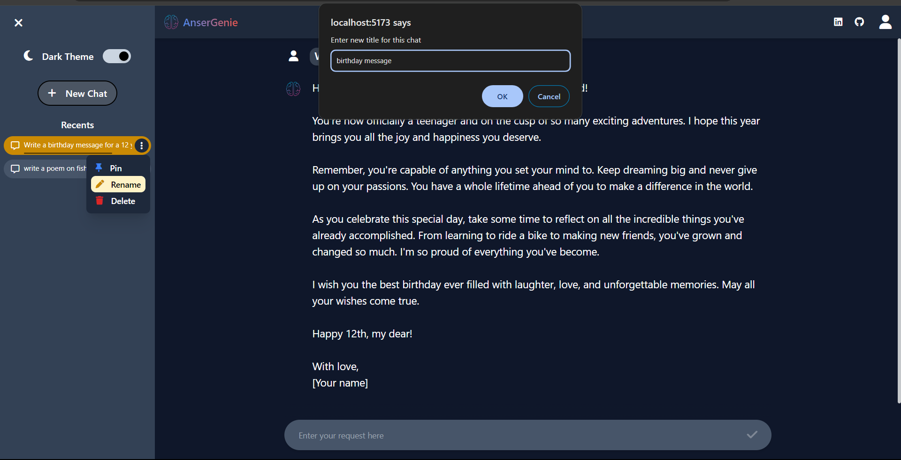
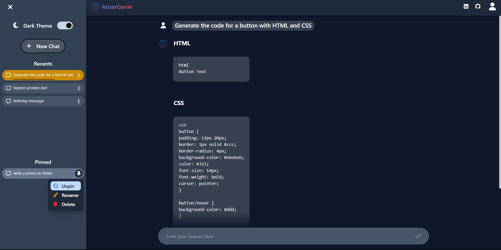

<div align="center">
  <div>
    
    
    
  </div>

  <h3 align="center">AnserGenie</h3>

   <div align="center">
     Visit this project live on <a href="https://areeb-ansergenie.netlify.app/" target="_blank">areeb-ansergenie.netlify.app</a>
    </div>
    
</div>

## _Watch the video:_
[](https://youtu.be/RF3PWc7UNmw)  

## 📋 <a name="table">Table of Contents</a>

1. 🤖 [Introduction](#introduction)
2. ⚙️ [Tech Stack](#tech-stack)
3. 🔋 [Features](#features)
4. 🤸 [Quick Start](#quick-start)
5. 🔗 [Links](#links)
6. 📺 [Screenshots](#screenshots)

## <a name="introduction">🤖 Introduction</a>

AnserGenie is a React application powered by Gemini's API, delivering intelligent answers to your inquiries. It features flexible chat management, customization, persistent storage, dark mode, and a fully responsive design for an optimal user experience.

## <a name="tech-stack">⚙️ Tech Stack</a>

- Vite
- React.js
- Tailwind CSS

## <a name="features">🔋 Features</a>

👉 **Multiple Chat Management**: Effortlessly create and navigate between multiple question threads with the AI.

👉 **Chat Customization**: Personalize your experience by renaming chats, deleting them, and pinning important conversations.

👉 **Persistent Storage**: Rest assured that your chats will be securely saved in localStorage, even after page reloads.

👉 **Dark Mode**: Enjoy a comfortable viewing experience in low-light environments with the built-in dark mode.

👉 **Responsive Design**: QuestionBox adapts seamlessly to desktops, tablets, and smartphones, offering a consistent experience across devices.

and many more, including code architecture and reusability

## <a name="quick-start">🤸 Quick Start</a>

Follow these steps to set up the project locally on your machine.

**Prerequisites**

Make sure you have the following installed on your machine:

- [Git](https://git-scm.com/)
- [Node.js](https://nodejs.org/en)
- [npm](https://www.npmjs.com/) (Node Package Manager)

**Cloning the Repository**

```bash
git clone https://github.com/AreebZaho/AnserGenie.git
cd AnserGenie
```

**Installation**

Install the project dependencies using npm:

```bash
npm install
```

**Running the Project**

```bash
npm run dev
```

Open [http://localhost:5173](http://localhost:5173) in your browser to view the project.

## <a name="links">🔗 Links</a>

- [Live Website](areeb-ansergenie.netlify.app)

# ✨ Show Your Support
## Give it a 🌟
_If you found this project helpful or enjoyed using it, please consider giving it a star on GitHub. This helps the project gain visibility and lets others know it's worth checking out. Thank you!_

## Contribute 🤝
_If you're interested in contributing to this project, please feel free to open a pull request or report any issues._

## <a name="screenshots">📺 Screenshots</a>






